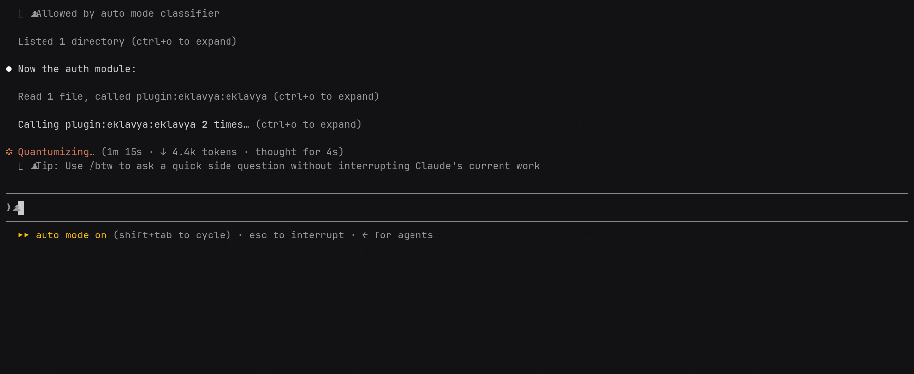

<div align="center">


# Eklavya

**Learn while your agent works — and never explain your own repo twice.**

*Named for Ekalavya, who mastered archery practicing before a silent statue of his guru. Here, the statue talks back.*



[](https://www.npmjs.com/package/eklavya)
[](LICENSE)
[](https://nodejs.org)

</div>

Eklavya is a Claude Code plugin that turns agent generation time into learning
time. While Claude Code implements your task, Eklavya teaches you the concepts
behind *that exact work* — adaptive Socratic questions grounded in the diff it
just wrote, mastery tracked in a local knowledge graph, and optionally a commit
gate until you can show you understood it.

Coding agents create a comprehension gap: you ship code you didn't write and
couldn't debug. The moment that code is being generated is the highest-leverage
teaching moment there is — the concepts are concrete, the code is on your screen,
and your hands are free. So Eklavya asks you about it, once per task, never the
same question twice, and harder each time you get it right.

It also **remembers** the work — what you asked for, what changed, what failed —
and hands the relevant history back at the start of the next session, so the
agent begins knowing what this project has already been through. That half is on
by default and runs separately from the questions.

Everything is local: with the default configuration the summariser and the
embedder both run on your machine. No accounts, no sync, no telemetry.

### **[→ Read the docs](https://eklavya-run.web.app/docs/)**

---

## Install

Needs **Node 22+**. Nothing else, on macOS, Linux or Windows.

```bash
npm install -g eklavya && eklavya install
```

That gives you the plugin and the `eklavya` command. Then run `/eklavya:setup`
inside Claude Code to choose how hard it pushes.

You can also install from the plugin marketplace inside Claude Code, with one
caveat about what a slash command is allowed to do — both routes and the caveat
are in **[Installing](https://eklavya-run.web.app/docs/installing/)**.

That covers Claude Code in a terminal and the Code tab in Claude Desktop, which
are the same engine on the same config. **Cowork** works too and keeps its own
plugin list, so install it there as well: Customize → Plugins → Add marketplace
→ `ProjectAJ14/eklavya`. All of them share one knowledge graph.

## How it works

You ask for something. Claude logs what the work touches, and that logging call
triggers a checkpoint: **one** multiple-choice question about the concept it just
logged, asked while the code is still on your screen. You answer in a couple of
seconds and Claude carries straight on. As the work goes on, another question
comes at most every four minutes, and when a turn finishes, at most one more —
never a pile, and never more than four a session.

Tier 1 asks what a thing is. Tier 5 asks when it is the wrong approach. You climb
as you get things right, which is how "never ask the same question twice"
survives contact with a finite concept graph. Difficulty is earned per project,
so a codebase you have just met starts easy however senior you are.

**[Your first session →](https://eklavya-run.web.app/docs/first-session/)**

## The manual

| | |
|---|---|
| [Installing](https://eklavya-run.web.app/docs/installing/) | Both routes, prerequisites, uninstalling |
| [The dials](https://eklavya-run.web.app/docs/dials/) | `quiz`, `focus`, `cadence`, `difficulty`, `memory` — what each one changes |
| [Memory](https://eklavya-run.web.app/docs/memory/) | What is captured, what never is, how recall works, and what the savings number means |
| [Levels and tiers](https://eklavya-run.web.app/docs/levels-and-tiers/) | How difficulty is earned, and what each tier asks |
| [Command reference](https://eklavya-run.web.app/docs/commands/) | Every `/eklavya:*` command — or just ask in plain English |
| [Configuration](https://eklavya-run.web.app/docs/configuration/) | Every key, its default, and which file wins |
| [The commit gate](https://eklavya-run.web.app/docs/commit-gate/) | `quiz.enforced`, and the git hook that works outside Claude Code |
| [Your data](https://eklavya-run.web.app/docs/your-data/) | Where the database lives and what never leaves the machine |
| [Troubleshooting](https://eklavya-run.web.app/docs/troubleshooting/) | When the loop is silent, and how to check why |

For tutoring that runs *during* generation in a second pane — one session
teaching while the other builds, sharing one database — see
[`docs/parallel-tutoring.md`](docs/parallel-tutoring.md).

## Stars

<a href="https://star-history.com/#ProjectAJ14/eklavya&Date">
  
</a>

## Contributing

Development setup, the manual test scripts and the release process are in
[`CONTRIBUTING.md`](CONTRIBUTING.md).

## License

MIT
