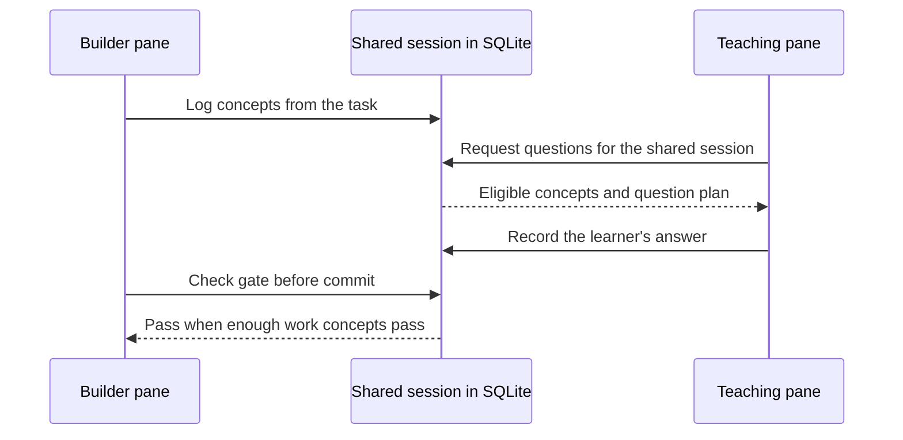

# Parallel tutoring

Eklavya normally asks a short question during work in the same conversation.
For a dedicated teaching conversation, use the tutor subagent or two terminal
panes. Both use the same local database; sharing a gate also requires the same
session identity.

## Use the tutor subagent

Ask Claude Code:

> Implement refresh-token rotation in auth.ts. Have the eklavya-tutor agent
> quiz me on the concepts while you work.

[`agents/tutor.md`](../agents/tutor.md) defines the available tools. The tutor
reads code, plans questions and records answers; it cannot edit implementation
files, change settings, log the builder's work or modify project memory. It has
no `AskUserQuestion`, so it presents lettered options as text. The parent and
subagent can take turns rather than run a truly simultaneous conversation.

The builder must log concepts first. The tutor's answers can then contribute
to the same mastery history and session gate. The tutor is exempt from the
implementer directive that says not to ask questions; see
[subagent policy](subagent-policy.md).

## Use two terminal panes

For independent conversations, start two Claude Code sessions in the same
checkout with the plugin installed and the same `EKLAVYA_SESSION_ID`. This tmux
example creates the shared ID before opening either pane:

```bash
export EKLAVYA_SESSION_ID="$(basename "$PWD")-$(date +%s)"
tmux new-session -d -s eklavya -n work "EKLAVYA_SESSION_ID=$EKLAVYA_SESSION_ID claude"
tmux split-window -t eklavya "EKLAVYA_SESSION_ID=$EKLAVYA_SESSION_ID claude"
tmux attach -t eklavya
```

Give the first pane the implementation task. In the second, run `/eklavya:quiz`
after concepts have been logged, or `/eklavya:learn <topic>` for guided study.
Answers about current work can release the first pane's gate; unrelated review
questions do not count as work-concept passes. Any terminal multiplexer works.



The panes share concepts and answers through the database, not conversation
messages. Tell the teaching pane what is being built if it lacks context.

## What is shared

| State | Scope |
|---|---|
| Concept graph, mastery and review schedule | Shared learner database |
| Session concepts, budget and gate | Shared only with the same session ID |
| Project settings and level | Main checkout, including its worktrees |
| Conversation messages | Separate in each pane |

Both panes capture their own tool calls. Both can also receive a Stop quiz;
their shared pacing markers prevent immediate duplicate sweeps. Adjust
`min_minutes_between_checkpoints` for `interleaved`, or
`min_minutes_between_quizzes` for `end`, when unenforced. `quiet` only hides
status; it does not silence questions. Session-scoped silence is shared too.

## Session identity details

`mcp/src/session.ts` resolves tool calls in this order: explicit tool argument,
`EKLAVYA_SESSION_ID`, the host's session, checkout-specific database pointer,
then `default`. The host's session is the ID the hooks last recorded for this
`claude` process (keyed by `CLAUDE_CODE_MESSAGING_SOCKET`, else by the startup
`CLAUDE_CODE_SESSION_ID`, so it follows `/clear`), else the server's own `CLAUDE_CODE_SESSION_ID`. Hooks prefer the
environment override before the host's input ID. Normally, tools should omit
`session_id`.

On a host that sets neither variable, two conversations in one checkout
compete for its current session pointer. Different Git roots, including worktrees, have separate
pointers; this deliberately differs from project settings, which fold worktrees
into the main checkout. Work outside Git shares the unscoped pointer.

SQLite WAL, short transactions and busy retries support concurrent access; see
`mcp/test/concurrency.test.ts`. This does not make each pane aware of the other's
conversation. Unset `EKLAVYA_SESSION_ID` after the shared session so unrelated
future sessions do not keep using it.
